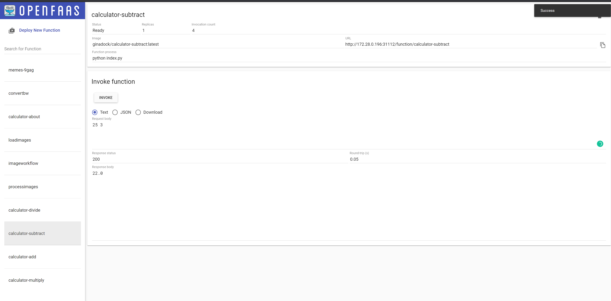

# OpenFaas-Function-Calculator

<p align="justify">If you already have OpenFaas installed, follow these steps to deploy it to existing stack:</p>

```bash
    faas-cli build -f ./calculator.yml
    faas-cli deploy -f ./calculator --gateway $OPENFAAS_URL
```

<p align="justify">or use the following command to build, deploy and push the functions to docker:</p>

```bash
    faas-cli up -f ./calculator.yml --gateway $OPENFAAS_URL
```

<p align="justify">or use the following command to remove the deployment:</p>

```bash
    faas-cli remove -f ./calculator.yml --gateway $OPENFAAS_URL
```

<br>

## Functions Overview

---

| Function Name | Description | Params | Output |
| -- | -- | -- | -- |
| [About](#about) | Hello from Calculator | none | string |
| [Add](#add) | Add two numbers | string | string |
| [Substract](#subtract) | Substract two numbers | string | string |
| [Devide](#divide) | Devide two numbers | string | string |
| [Multiply](#multiply) | Multiply two numbers | string | string |
| [Fibonacci](#fibonacci) | Generate fibonacci sequence with specific length | string | string |

<br>

## About 

---

| Function Name | Description | Params | Output |
| -- | -- | 
| [About](./about/handler.py) | Hello from Calculator | none | string |

<p align="justify">Invoke with curl:</p>

```bash
curl --location --request GET 'http://172.28.0.196:31112/function/calculator-about'
```

<p align="justify">Invoke with faas-cli:</p>

```bash
    faas-cli invoke calculator-about
```

<p align="justify">Output will look something like this:</p>


<br>


## Add 

---

| Function Name | Description | Params | Output |
| -- | -- | 
| [Add](./add/handler.py) | Add two numbers | string | string |

<p align="justify">Invoke with curl:</p>

```bash
curl --location --request GET 'http://172.28.0.196:31112/function/calculator-add'
```

<p align="justify">Invoke with faas-cli:</p>

```bash
    echo "25 3" | faas-cli invoke calculator-add
```

<p align="justify">Output will look something like this:</p>


<br>

## Subtract 

---

| Function Name | Description | Params | Output |
| -- | -- | 
| [Subtract](./subsract/handler.py) | Substract two numbers | string | string |

<p align="justify">Invoke with curl:</p>

```bash
curl --location --request GET 'http://172.28.0.196:31112/function/calculator-subtract'
```

<p align="justify">Invoke with faas-cli:</p>

```bash
    echo "25 3" | faas-cli invoke calculator-subtract
```

<p align="justify">Output will look something like this:</p>



<br>

## Multiply 

---

| Function Name | Description | Params | Output |
| -- | -- | 
| [Multiply](./multiply/handler.py) | Multiply two numbers | string | string |

<p align="justify">Invoke with curl:</p>

```bash
curl --location --request GET 'http://172.28.0.196:31112/function/calculator-multiply'
```

<p align="justify">Invoke with faas-cli:</p>

```bash
    echo "25 3" | faas-cli invoke calculator-multiply
```

<p align="justify">Output will look something like this:</p>


<br>

## Divide 

---

| Function Name | Description | Params | Output |
| -- | -- | 
| [Devide](./devide/handler.py) | Devide two numbers | string | string |

<p align="justify">Invoke with curl:</p>

```bash
curl --location --request GET 'http://172.28.0.196:31112/function/calculator-divide'
```

<p align="justify">Invoke with faas-cli:</p>

```bash
    echo "25 3" | faas-cli invoke calculator-divide
```

<p align="justify">Output will look something like this:</p>


<br>

## Divide 

---

| Function Name | Description | Params | Output |
| -- | -- | 
| [Fibonacci](#fibonacci) | Generate fibonacci sequence with specific length | string | string |

<p align="justify">Invoke with curl:</p>

```bash
curl http://172.28.0.196:31112/function/calculator-fibonacci -d "10"
```

<p align="justify">Invoke with faas-cli:</p>

```bash
    echo "5" | faas-cli invoke calculator-fibonacci
```

<p align="justify">Output will look something like this:</p>


---

<br>

## Authors

* **<a href="https://github.com/GinaCha" target="_blank">`Gina Chatzimarkaki`</a>.** - *Initial work* 
