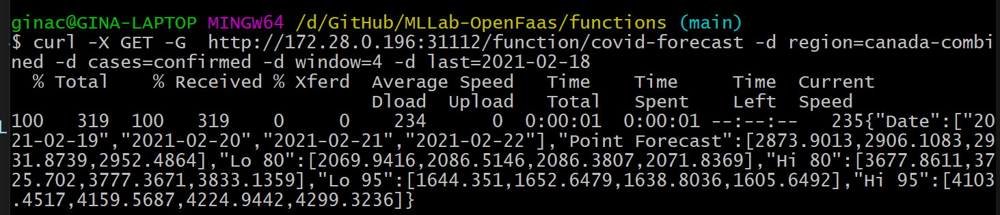

# OpenFaas-Covid-Stats

<p align="justify">If you already have OpenFaas installed, follow these steps to deploy it to existing stack:</p>

```bash
    faas-cli build -f ./stack.yml
    faas-cli deploy -f ./stack.yml --gateway $OPENFAAS_URL
    faas-cli push -f ./stack.yml
``` 

faas-cli deploy --image alexellis/inception --name inception --fprocess "python3 index.py" --gateway $OPENFAAS_URL

<p align="justify">or use the following command to build, deploy and push the functions to docker:</p>

```bash
    faas-cli up -f ./stack.yml --gateway $OPENFAAS_URL
```

<p align="justify">or use the following command to remove the deployment:</p>

```bash
    faas-cli remove -f ./stack.yml --gateway $OPENFAAS_URL
```


<p align="justify">Invoke with curl:</p>

```bash
curl -X GET -G  http://172.28.0.196:31112/function/covid-forecast -d region=canada-combined -d cases=confirmed -d window=4 - last=2021-02-18
```

<p align="justify">Invoke with faas-cli:</p>

```bash
    faas-cli invoke covid-stats http://172.28.0.196:31112/function/covid-forecast?region=canada-combined&cases=confirmed&window=4&last=2021-09-09
```

<p align="justify">Output will look something like this:</p>



---

<br>

## Authors

* **<a href="https://github.com/GinaCha" target="_blank">`Gina Chatzimarkaki`</a>.** - *Initial work* 
