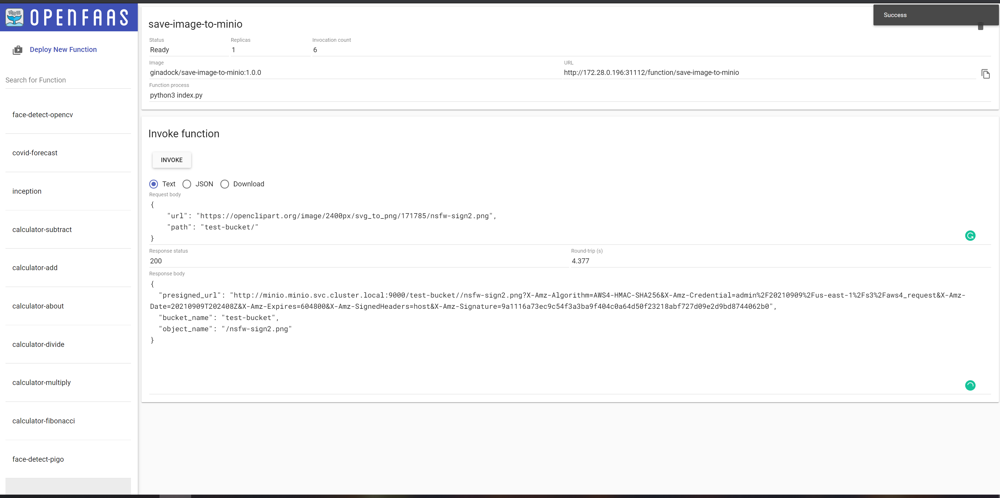

## OpenFaas Save Image to Minio Function 

---

| Function Name | Description | Params | Output |
| -- | -- | 
| [save-image-to-minio](#save-image-to-minio) | Saves the given image (provided by url) to a specified bucket in minio (if bucket with the given name not exists , it will create one | string | string |


<p align="justify">Input Sample:</p>

```json
{
    "url": "https://openclipart.org/image/2400px/svg_to_png/171785/nsfw-sign2.png",
    "path": "test-bucket/"
}
```

<p align="justify">Invoke with curl:</p>

```bash
curl -k http://172.28.0.196:31112/function/save-image-to-minio  -X PUT -d'{"url": "https://openclipart.org/image/2400px/svg_to_png/171785/nsfw-sign2.png", "path": "test-bucket/" }'
```

<p align="justify">Invoke with faas-cli:</p>

```bash
    echo '{"url": "https://openclipart.org/image/2400px/svg_to_png/171785/nsfw-sign2.png", "path": "test-bucket/" }' | faas-cli invoke save-image-to-minio
```

<p align="justify">Output will look something like this:</p>



---

<br>

## Authors

* **<a href="https://github.com/GinaCha" target="_blank">`Gina Chatzimarkaki`</a>.** - *Initial work* 
